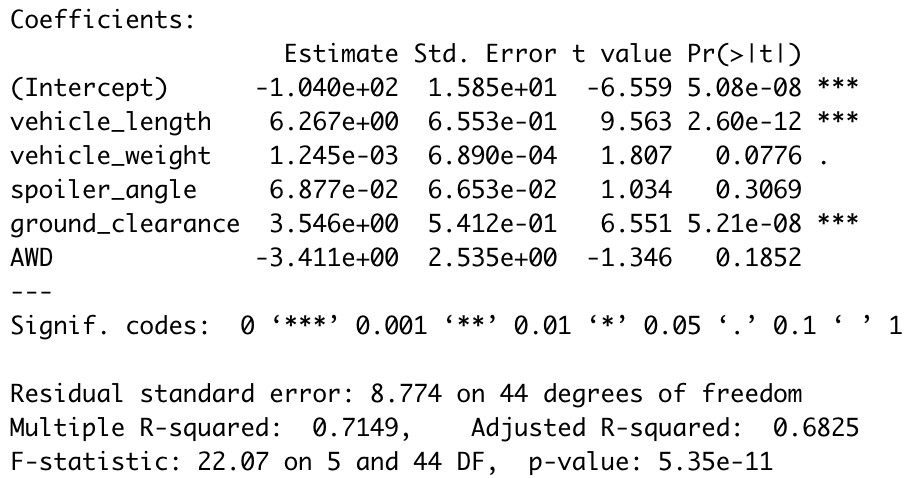
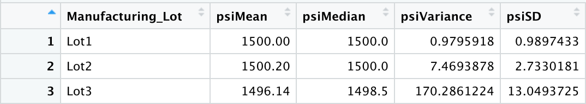
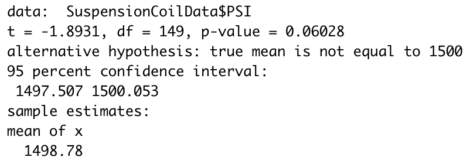
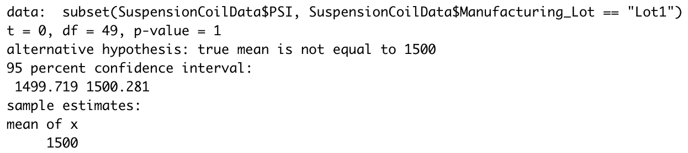
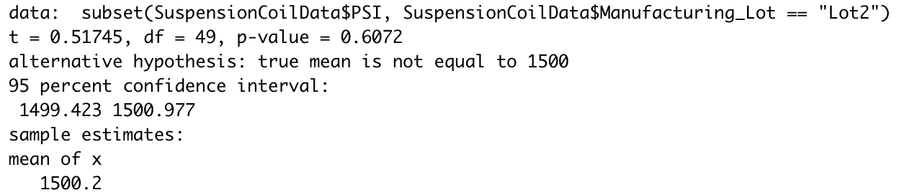
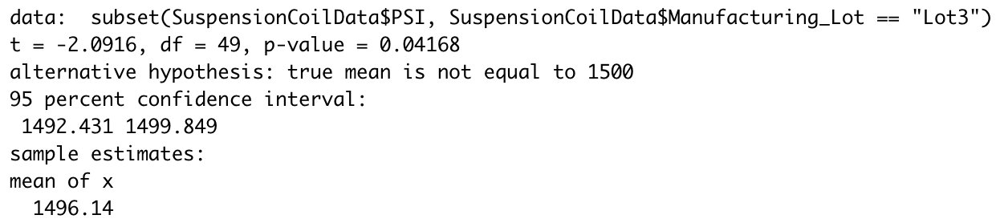

# 15MechaCar_Statistical_Analysis

## Linear Regression to Predict MPG

1. The table above shows that the two variables that will have an affect on MPG are vehicle length and ground clearence. We are able to draw this conclusion because their p-value is well below the significance level of 0.05%, meaning that they most likely wont produce a random amount of variance.

2. The slope of our liner model is not 0. This is because our p-value is 5.35-e11. Since our p-value is so low, we can safely reject a null-hypothesis, which tells us that the slope is not 0.

3. Our linear model can be used to effecively predict the mpg of the MechaCar prototypes. We know this because the r-squared value is 0.7149, meaning that about 72% of the variability of mpg can be explained using this linear model.

## Summary Statistics on Suspension Coils

The design specs for the MechaCar suspension coils say that the variance of the suspension coils must not exceed 100 pounds per square inch. In the table abovr, we can see that PSI variance is 62.29 meaning that total dataset does meet the requirements for the design specs.

Although the total summary meets the requirements, as you can see above, only lot 1 (0.97 PSI) and lot 2 (7.45 PSI) meet the requirements of having a variance under 100 PSI.

## T-Tests on Suspension Coils

In the table above you can see that we have a p-value of 0.06028 which is above the significance level of 0.05%. With this information we can draw the conclusion that we don't have enough evidence to reject a null hypothesis, which means that the means population means are statistically similar. In the following images you will see a more in-depth analysis of the 3 lots.

# Lot 1

# Lot 2

# Lot 3

As you can see, in lots 1 and 2, we do not have enough evidence to reject a null hypothesis and in lot 3 we do have enough eveidence to reject a null hypothesis which means that lot 3 mean and its presumed population mean are not statistically similar

## Study Design: MechaCar vs Competition

There are multiple variables one could use to show that MechaCar greatly stands up to their competion such as cost, mpg, maintenance, horse power,  and fuel efficiency.
The hypothesis could go as follows: 
- Null hypothesis: There is no statistical difference between the price of the MechaCar and its presumed population average price.
- Alternative hypothesis: There is a statistical difference between the price of the MechaCar and its presumed population average price.

I could use a linear regression model to test this hypothesis since we have more than two variables to use.
